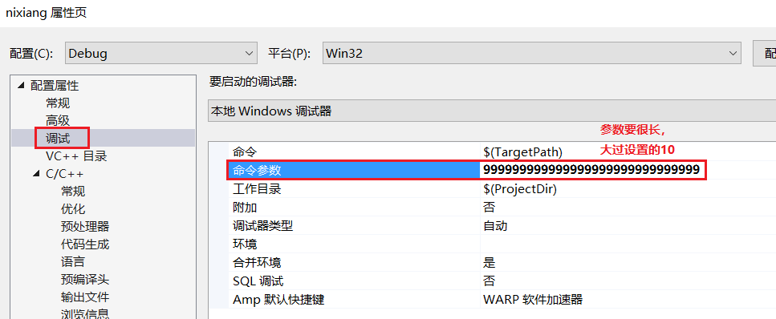
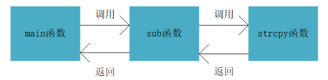
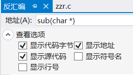
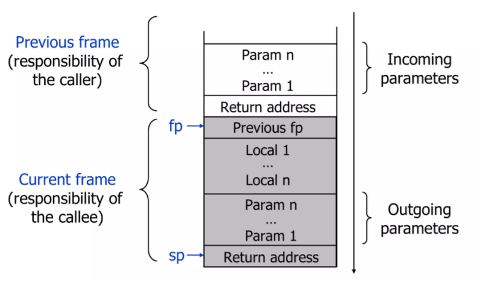
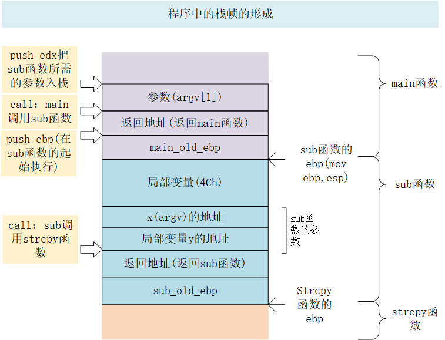
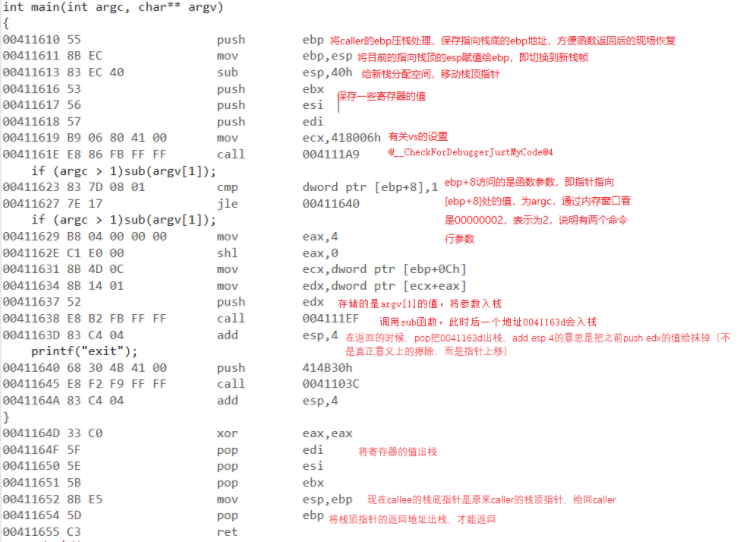
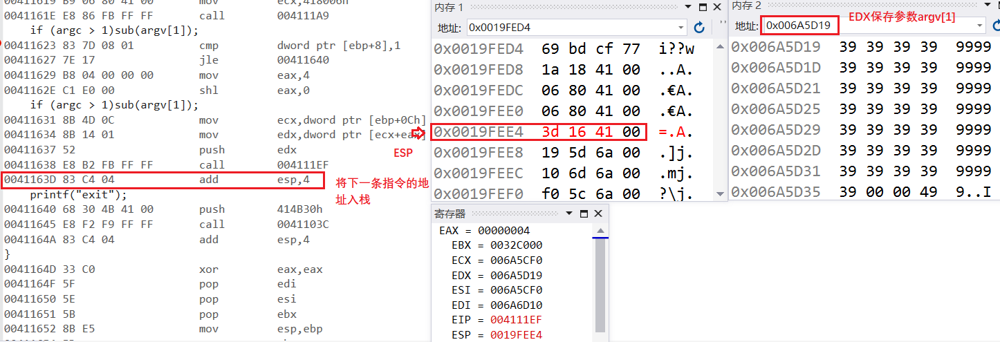
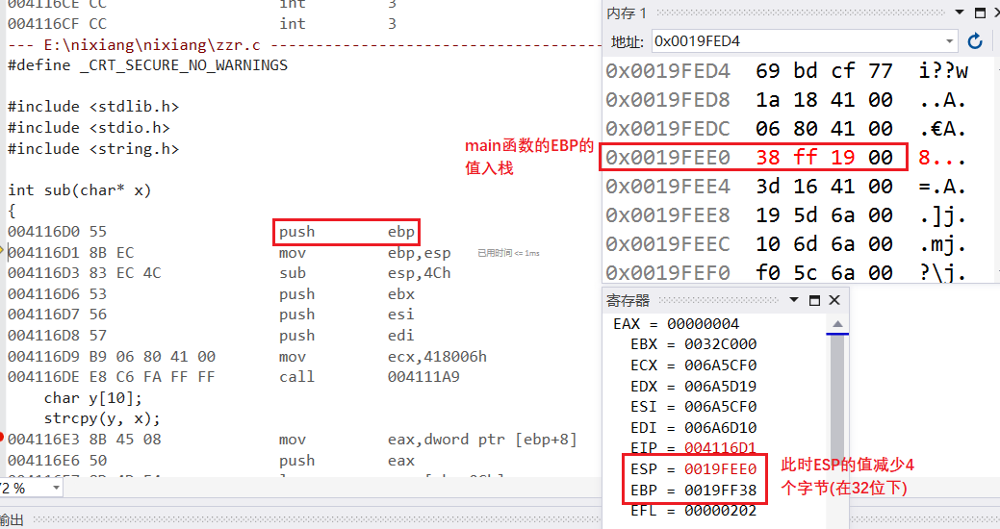
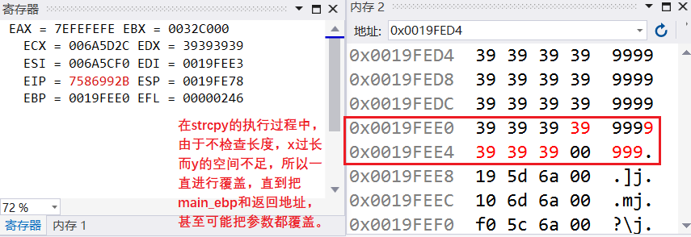

# 缓冲区溢出实验 #
## 实验环境 ##
- Visual Studio 2017

## 实验目的 ##
- 观察、测试和分析一段存在缓冲区溢出漏洞的代码；
- 分析缓冲区溢出漏洞出现的原因和效果；
- 深入理解栈帧，以及相关寄存器的使用。

## 实验内容 ##
### 1.缓冲区溢出漏洞的代码 ###
- 建立.c文件，并编辑代码
  ```
  #define _CRT_SECURE_NO_WARNINGS
  #include <stdlib.h>
  #include <stdio.h>
  #include <string.h>

  int sub(char* x)
  {
    char y[10];
    strcpy(y, x);
    return 0;
  }

  int main(int argc, char** argv)
  {
    if (argc > 1)
        sub(argv[1]);
    printf("exit");
  }
  ```

### 2.实验前的准备 ###
- 去除VS2019的一些检查机制
 -  取消启用C++异常(即取消编译器检测C++异常)、取消基本运行时检查(即不执行基本运行时的错误检查)、禁用安全检查(安全检查可以检测到堆栈缓冲区溢出，所以去掉)
 
 - 取消SDL检查(即取消安全开发生命周期建议的其他检查，不启用其它安全代码生成功能并不启用额外的安全相关警告作为错误)。
 
- 设置过长的命令行参数值：在vs2019的命令行参数下，设置一个超过10位字符的字符串，如下


### 3.在调试情况下进行反汇编，观察缓冲区溢出 ###
- 观察栈帧的形成
 - 调用关系图
 
 - 在strcpy(y,x)处下断点，进入调试窗口。右键转到反汇编，设置如下选项。选择vs顶栏的调试->窗口->内存和寄存器，就可以看到内存窗口和寄存器窗口
 
 - 栈帧的形成
   - 内存地址空间分布
     - 栈(stack)：堆栈，存放程序的局部变量，在函数被调用时，栈用来传递参数和返回值等，用来保存/恢复调用现场。栈是向下增长，从高地址向低地址延伸。
   
     - 堆(heap)：堆是用于存放进程运行中被动态分配(malloc)的内存段，它的大小并不固定，可动态扩张或缩减。堆是向上增长。
     - BSS段(Block Started by Symbol segment)：通常是指用来存放程序中未初始化的全局变量和静态变量的一块内存区域。BSS段属于静态内存分配。
     - 数据段(data segment)：通常是指用来存放程序中已初始化的全局变量和静态变量的一块内存区域。数据段属于静态内存分配。
     - 代码段(code segment/text segment)：通常是指用来存放程序执行代码的一块内存区域。这部分区域的代码属于只读。在代码段中，字符串常量也属于这部分。
   - 函数调用
     - 参数入栈: 将参数按照调用约定(C 是从右向左)依次压入系统栈中;
     - 返回地址入栈: 将当前代码区调用指令的下一条指令地址压入栈中，供函数返回时继续执行;
     - 代码跳转: 处理器将代码区跳转到被调用函数的入口处。
   - 函数返回
     - 保存被调用函数的返回值到 eax 寄存器中；mov eax, xxx
     - 恢复 esp 同时回收局部变量空间；mov ebp, esp
     - 将上一个栈帧底部位置恢复到ebp；pop ebp
     - 弹出当前栈顶元素,从栈中取到返回地址,并跳转到该位置、 ret
   - 栈帧(Stack Frame)：在函数调用的过程中，要为函数开辟栈空间，用于记录函数调用过程的一些局部变量和中间数据、现场保存，这块栈空间称为栈帧
     - 代码和栈是分开的，每个线程一个栈，可以说一个独立的栈帧对应一个未完成的函数。同一个程序内的函数的栈帧是连续的。
     - 此程序栈帧的形成。
   
   - main函数的分析
   
   - sub函数的分析
   
   - 重点观察寄存器ESP，EBP，EIP等的变化，当调用者(caller)调用被调用者(callee)的时候，执行call之后，caller的下一条指令地址会入栈
   
   - 每次进入一个新的函数时，会先push ebp，即将调用者(caller)的EBP的值保存下来，同时ESP寄存器会减少4个字节(在32位下)
   
- 缓冲区溢出的发生
 - 在strcpy函数的赋值过程中，即x赋值给y，而y处的空间只有12个字节
 
 - sub函数的栈帧被破坏
 
 - 缓冲区溢出。依据我们填入的命令行参数，由于9的ASCII码为39，所以以39进行覆盖
 

## 总结 ##
- 缓冲区溢出：为缓冲区提供了多于其存储容量的数据。
- 通常情况下，缓冲区溢出的数据只会破坏程序数据，造成意外终止。若精心构造溢出数据的内容，有可能获得系统的控制权，可以让系统执行这块可读写内存中已经被蓄意设定好的恶意代码。
- 可行性
 - 程序代码和程序数据是作为二进制数据存储在内存的，因此直接从内存的二进制形式上是无法区分数据和代码；
 - 除了代码段和受操作系统保护的数据区域，其他的内存区域都可能作为缓冲区，因此缓冲区溢出的位置可能在数据段，也可能在堆、栈段；
 - 当函数内的一个数组缓冲区接受用户输入的时候，程序代码未对输入的长度进行合法性检查。
- strcpy不检查长度可能出现的问题
 - 覆盖其他的局部变量。如果被淹没的局部变量是条件变量，那么可能会改变函数原本的执行流程。
 - 覆盖ebp的值。修改了函数执行结束后要恢复的栈指针，将会导致栈帧失去平衡。
 - 覆盖返回地址。这是栈溢出原理的核心，通过覆盖的方式修改函数的返回地址，使程序代码执行“意外”的流程。
 - 覆盖参数变量。修改函数的参数变量也可能改变当前函数的执行结果和流程。
 - 覆盖上级函数的栈帧，影响上级函数的执行。
- 借助跳板的栈溢出攻击
 - 原因：操作系统每次加载可执行文件到进程空间的位置都是无法预测，因此栈的位置实际是不固定的，通过硬编码覆盖新返回地址的方式并不可靠。
 - 通过借助跳板的栈溢出方式准确定位shellcode(恶意代码，一般指拿到系统的shell)的地址。
  - 方法：
    - 函数执行后，栈指针esp会恢复到压入参数时的状态。用一段跳板指令覆盖返回地址，该跳板指令中含有jmp esp，即执行完跳板指令后还会回到原位，将参数部分用shellcode覆盖，即可执行恶意代码。
   - 得到跳板指令：Windows操作系统加载dll时候一般都是固定地址，因此这些dll内的跳板指令的地址一般都是固定的。离线搜索出跳板执行在dll内的偏移，并加上dll的加载地址。
   - 缺点：在esp后继续追加shellcode代码会将上级函数的栈帧淹没